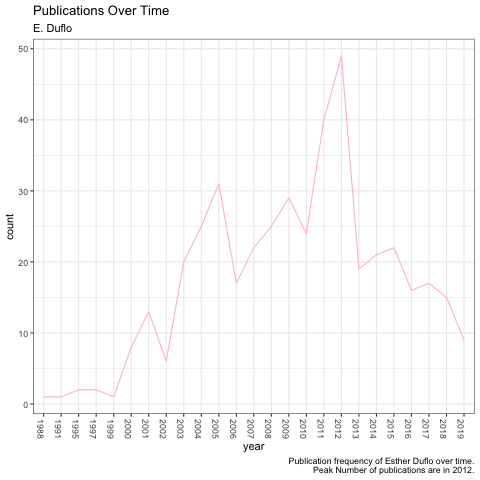
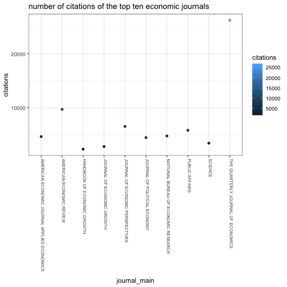

```{r setup, include=FALSE}
knitr::opts_chunk$set(echo = TRUE)
library(dplyr)
library(ggplot2)
save.image(file="workout3.RData")
```

## Comparing Abhijit Banerjee and Esther Duflo

### read clean data.
```{r}
ab <- read.csv("../data/cleandata/abhijit_banerjee_gsc.csv")
ed <- read.csv("../data/cleandata/esther_duflo_gsc.csv")

df.ab <- as.data.frame(ab, header=TRUE, stringsAsFactors= FALSE)
df.ed <- as.data.frame(ed, header=TRUE, stringsAsFactors= FALSE)
```

### Some Regex Analysis
First we will begin with simple regex analysis of the data.

### Starting of paperName is a Vowel

#### A. Banerjee
```{r}
#filter through the data frame using dplyr
filtered_papers <- df.ab %>% 
  filter(grepl('^[AEIOU]', paperName)) %>%  
  select(paperName)
# find the length of the paperName column
length(filtered_papers[[1]])
```

#### E. Duflo
```{r}
filtered_papers <- df.ed %>% 
  filter(grepl('^[AEIOU]', paperName)) %>%
  select(paperName)

length(filtered_papers[[1]])
```


### Ends with "s"

#### A. Banerjee
```{r}
library(stringr)
#filter through the data frame using dplyr
filtered_papers <- df.ab %>% 
  filter(grepl('s$', paperName)) %>%  
  select(paperName)
# find the length of the new paperName column
length(filtered_papers[[1]])
```
#### E. Duflo
```{r}
library(stringr)
#filter through the data frame using dplyr
filtered_papers <- df.ed %>% 
  filter(grepl('s$', paperName)) %>%  
  select(paperName)
# find the length of the paperName column
length(filtered_papers[[1]])
```

### Longest title

#### A. Banerjee
```{r}
paperName_ab <- lapply(df.ab$paperName, as.character) # due to class errors.
lens <- nchar(paperName_ab) #vector of lengths
longtitle_ab <- paperName_ab[which.max(lens)]
longtitle_ab[[1]]
```

#### E. Duflo
```{r}
paperName_ed <- lapply(df.ed$paperName, as.character)
lens <- nchar(paperName_ed)
longtitle_ed <- paperName_ed[which.max(lens)]
longtitle_ed[[1]]
```


### Number of punctuation symbols in titles

#### A. Banerjee
```{r}
# make vector of paper titles
papers_ab <- lapply(df.ab$paperName, as.character)
# remove all alpha numeric values and spaces
punctuations_ab <- gsub("[[:alnum:]]| ", '', papers_ab)

#count lens in each row of strip
counts_ab <- df.ab %>% 
  mutate("counts" = nchar(punctuations_ab)) %>%
  select(paperName, counts)

head(counts_ab)
```

#### E. Duflo
```{r}
# make vector of paper titles
papers_ed <- lapply(df.ed$paperName, as.character)
# remove all alpha numeric values and spaces
punctuations_ed <- gsub("[[:alnum:]]| ", '', papers_ed)

#count lens in each row of strip
counts_ed <- df.ed %>% 
  mutate("counts" = nchar(punctuations_ed)) %>%
  select(paperName, counts)

head(counts_ed)
```


### Remove Stop Words, Numbers, Punctuations from titles

#### A. Banerjee
```{r}
stop <- c("the", "a", "an", "and", "in", "if", "but")
#regex patterns to remove. 
to.remove <- "\\b(the|The|a|A|an|An|and|And|in|In|if|If|but|But)\\b"
pd <- "[[:punct:]]|[[:digit:]]"


df.removed.ab <- df.ab %>% 
  mutate("removedName"= gsub(to.remove, " ", paperName)) %>%
  mutate("removedName" = gsub("-", " ", removedName)) %>%
  mutate("removedName" = gsub(pd, "", removedName))
  
df.rem.ab <- select(df.removed.ab, removedName, paperName)

```

#### E. Duflo
```{r}
df.removed.ed <- df.ed %>% 
  mutate("removedName"= gsub(to.remove, " ", paperName)) %>%
  mutate("removedName" = gsub("-", " ", removedName)) %>%
  mutate("removedName" = gsub(pd, "", removedName))
  
df.rem.ed <- select(df.removed.ed, removedName, paperName)

```


### A: A. Banerjee's 10 most frequent words

```{r}
# vector of removed paper names.
r.ab <- df.rem.ab$removedName

# make all words lowercase
r.ab <- tolower(r.ab)
# combine vector into one string
s <- paste(r.ab, collapse=" ")
```

```{r}
# split string into a vector containing all words.
v <- strsplit(s, " ")
df.v <- data.frame(v, stringsAsFactors = FALSE)
colnames(df.v) <- c("word")

# remove empty strings and spaces
df.v <- filter(df.v, word != "" & word != " " & length(word) > 1)

# create a table to count freqs
words.freq <- table(df.v)

# bind table into a data frame
words.freq <- cbind.data.frame(names(words.freq),as.integer(words.freq), stringsAsFactors=FALSE)
colnames(words.freq) <-  c("word", "count")

# order the data frame with highest counts to lowest
w.count <- words.freq[with(words.freq, order(-count)),]

# display 10 most frequent words
head(w.count, 10)
```


### B: Esther Duflo's 10 most frequent words

```{r}
# vector of removed paper names.
r.ed <- df.rem.ed$removedName

# make all words lowercase
r.ed <- tolower(r.ed)
# combine vector into one string
s.b <- paste(r.ed, collapse=" ")
```

```{r}
# split string into a vector containing all words.
v.b <- strsplit(s.b, " ")
df.b <- data.frame(v.b, stringsAsFactors = FALSE)
colnames(df.b) <- c("word")

# remove empty strings and spaces
df.b <- filter(df.b, word != "" & word != " " & length(word) > 1)

# create a table to count freqs
w.b.freq <- table(df.b)

# bind table into a data frame
w.b.freq <- cbind.data.frame(names(w.b.freq), 
                               as.integer(w.b.freq), 
                               stringsAsFactors=FALSE)
colnames(w.b.freq) <-  c("word", "count")

# order the data frame with highest counts to lowest
w.b.count <- w.b.freq[with(w.b.freq, order(-count)),]

# display 10 most frequent words
head(w.b.count, 10)
```


### Digging into word frequencies.

To visualize the frequencies calculated in the previous step, we will now use the R library, word cloud. <a href="https://cran.r-project.org/web/packages/wordcloud/wordcloud.pdf">Read more about wordcloud</a>. The data visualization code can be found in <a href="functions.R">functions.R</a>

#### Banerjee:
```{r echo=FALSE, fig.align='center'}
knitr::include_graphics('../images/wordcloud_banerjee.png')
```

#### Duflo:
```{r echo=FALSE, fig.align='center'}
knitr::include_graphics('../images/wordcloud_duflo.png')
```


We can observe here that there are quite a lot of overlap between the two scholars. To further analyze this, I will analyze next the number of publications throughout the years of the two scholars.

```{r echo=FALSE, fig.align='center'}
knitr::include_graphics('../images/publications_banerjee.png')

```

While banerjee had an early start to his research career, both scholars picked up on the frequency of their publications by year 2012, which is the peak for both of them. While Banerjee remeains steady after, Duflo does show a slightly downward trend.

Interestingly, of the top 10 most frequent words in the titles, both Banerjee and Duflo shared multiple words. I will be analyzing the words "india", "economics", "development" and "evidence"

Plotting the frequencies of these words by year we can see that with the growth of publications they all rise. However, it differs between the two scholars slightly:

```{r echo=FALSE, fig.align='center'}
knitr::include_graphics('../images/wc_banerjee.png')
knitr::include_graphics('../images/wc_duflo.png')
```

We can see that both Banerjee and Duflo spiked in the usage of these words expeically between they year 2000 and 2010. However, both parties in the last decade have steered away from using the four terms, with the exception of Banerjee and his relationship with "evidence", as it has risen steadily since the year 2000.


### Exploring More Questions:

While scrolling through the original website, there were a distinct number of journals and papers that seemed to reference one another as their co-authors.

Digging into this deeper, I have analyzed the following relationships regarding the co-authors of the journals of each scholar.

#### Q1: whats the paper with the most coauthors?

To approach this problem, I will follow a similar analysis as the filtered papers as before. Only this time, I will be counting the "," symbol in regex.
```{r}
#filter through the data frame using dplyr

#Banerjee
researchers <- df.ab %>% 
  mutate(
    "author_count" = ifelse(
      grepl("Unpublished paper", as.character(researcher), fixed=TRUE),
      1,
      str_count(gsub(', [[:digit:]]',"", as.character(researcher)), ',') + 1)) %>%
  select(paperName, researcher, author_count)

researchers[which.max(researchers$author_count),]
ab_co <- mean(researchers$author_count)
```
```{r}
#Duflo
researchers <- df.ed %>% 
  mutate(
    "author_count" = ifelse(
      grepl("Unpublished paper", as.character(researcher), fixed=TRUE),
      1,
      str_count(gsub(', [[:digit:]]',"", as.character(researcher)), ',') + 1)) %>%
  select(paperName, researcher, author_count)

# researchers[with(researchers, order(-author_count)),]
researchers[which.max(researchers$author_count),]
ed_co <- mean(researchers$author_count)
```

Between both scholars, the paper, "Russia's Phony Capitalism" has the most co-authors.


#### Q2: on avg who had more co-authors?

```{r}
# see above for calc
#banerjee
ab_co
# duflo
ed_co
```

On average Banerjee had higher co-author counts.


#### Q3: do the two scholars have mutual friends?

```{r}
ab_co_authors <- df.ab %>% 
  mutate(
    "authors" = ifelse(
      grepl("Unpublished paper", as.character(researcher), fixed=TRUE),
      "",
      str_split(gsub(', [[:digit:]]',"", as.character(researcher)), ','))) %>%
  select(paperName, researcher, authors)

# remove scholars
ab.co <- gsub(',|A Banerjee|A. Banerjee|A. Banerjee.|A BANERJEE|E Duflo', "", ab_co_authors$authors)
# formatting to be prettier
ab.co <- gsub('\"|c|[()]|[...]', "", ab.co)
ab.co <- trimws(ab.co, which=c("both"))
ab.co <- paste(ab.co, collapse="&")
ab.co <- strsplit(ab.co, "&|  ")
ab.co <- ab.co[[1]]

# unique list of co-authors from Banerjee's papers
ab.co <- unique(toupper(ab.co))
ab.co <- ab.co[ab.co != ""]

```

```{r}
ed_co_authors <- df.ed %>% 
  mutate(
    "authors" = ifelse(
      grepl("Unpublished paper", as.character(researcher), fixed=TRUE),
      "",
      str_split(gsub(', [[:digit:]]',"", as.character(researcher)), ','))) %>%
  select(paperName, researcher, authors)

# remove scholars
ed.co <- gsub(',|A Banerjee|A. Banerjee|A. Banerjee.|A BANERJEE|E Duflo', "", ed_co_authors$authors)
# formatting to be prettier
ed.co <- gsub('\"|c|[()]|[...]', "", ed.co)
ed.co <- trimws(ed.co, which=c("both"))
ed.co <- paste(ed.co, collapse="&")
ed.co <- strsplit(ed.co, "&|  ")
ed.co <- ed.co[[1]]

# unique list of co-authors from Duflo's papers
ed.co <- unique(toupper(ed.co))
ed.co <- ed.co[ed.co != ""]

```

We use the statistical function intersect() to get the names of intersecting co-authors between the two unique sets as found above. 
```{r error=TRUE}

friends <- intersect(ab.co, ed.co)
friends

```


Q4: did the two publish together?
```{r}
ab.together <- ab_co_authors %>% 
  filter(grepl('E Duflo|E DUFLO', as.character(researcher)))

papers_together <- ab.together$paperName

head(sort(papers_together))

# total number of papers co-authored together:
length(papers_together)
```

Seeing how they worked together and how their research seems to be similarly aligned from the previous analysis of word frequency, I further examined the citations of the scholars's works to see if there is a great difference between them.

Q8: count the total number of citations for each journal.

We will aggregate the citations data based on the journal. I defined a stand alone journal as a journal with a title disregarding it's volume, edition, year, or serial number. 
```{r}
# combine the two dfs of the two scholars
df.both <- rbind.data.frame(df.ab, df.ed)
#filter original df to get data that has citations, a journal, and strip the journal of numbers and punctuations (omit volume and year of journal for this purpose)
c <- df.both %>%
  select(paperName, journal, citations) %>%
  mutate("journal_main" = toupper(gsub('[[:punct:]]|[[:digit:]]', '', journal))) %>% 
  filter(!is.na(citations)) %>%
  filter(journal != "")

# use aggregate to count up citations
agg <- aggregate(c$citations, by=list("journal_main"=c$journal_main), FUN=sum)
colnames(agg) <- c("journal_main", "citations")

# order by decreasing number of citations
agg<- agg[with(agg, order(-citations)),]

head(agg)
```

Q9: From the citations data, which journal do you think is the most influential in their academic field?
```{r}
# first row will be the largest cited one
agg[1,]
```

The quarterly journal of economics seems to be the most influential with 26220 citations thus far. The second closest is the American Economic Review at 9698, less than half the citations of the former.

Visually, this can be seen like so:
```{r}
top_ten <- head(agg,10)
top_ten
```


```{r hidden=TRUE}

```

```{r echo=FALSE, fig.align='center'}

```


That concludes my analysis of the two scholars. Further things to explore would be the number of pages for each paper and the correlation between pages an number of citations.

It would be interesting to also compare the other co-authors that were found in the prior sections.

